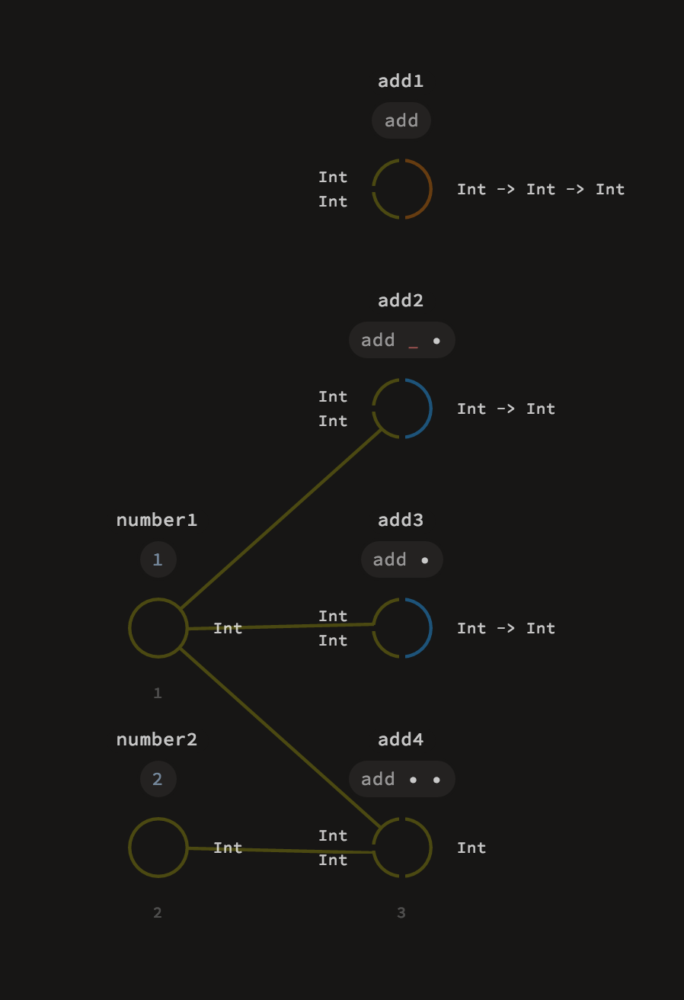

## Calling functions

Calling functions in text is accomplished by passing space–separated arguments. In the visual graph it corresponds to setting the values of respective input ports on a node – either by connecting other values to them or setting the values in the expression or by using port controls such as sliders.

```
a = 1
b = 2
c = add a b
d = add 53 2
```


## First order functions

Functions in Luna are first order citizens. It means that you can treat them like any other value. You can assign them to variables, pass as arguments to other functions or even store them in other data structures, like lists or maps. Many classes and libraries in Luna define functions or methods which expect other functions as their arguments. Most common examples are `List` methods `each` and `fold`. The former takes a single argument function and calls it on each element of the list, while the latter takes a two-argument function which is used to combine all the elements:
```
f = x: x + 2
myList = [1, 2, 3]
myList.each f # => [3, 4, 5]
myList.fold 0 add # => 6
```


## Currying

Luna supports currying. This means, that you may provide fewer arguments than the function expects. This fixes some of the function arguments, allowing to pass the rest later on. This is particularly useful when passing functions as arguments. Using currying, we can rewrite the example from previous section as:
```
myList = [1, 2, 3]
myList.each (+ 2)
```
It is also important to understand how currying works when using nodes. Whenever you don't set a port's value, this argument is automatically curried. This is shown by the changing type of the node's output. Note how the output type changes depending on the number of ports connected, showing the different curried variants of a function:



1. The `add1` node does not set any arguments, thus the output type is `Int -> Int -> Int`,
2. The `add2` node has the second argument connected, so the output type is `Int -> Int`. Note the `_` in it's expression. This underscore introduces explicit currying for this argument – `add _ number1` means "set the second argument and leave the first one unapplied",
3. The `add3` node applies the first argument and leaves the second one. There is no need for the `_` in this case, since the applied argument precedes the unapplied. The type is the same as that of `add2`, since both arguments have the same type.
4. The `add4` node is fully applied, so the return type is just `Int`.