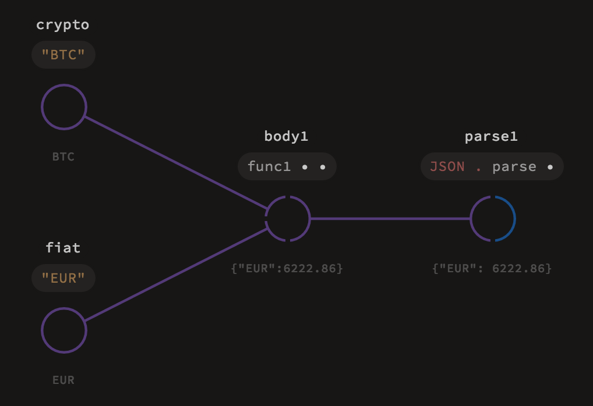

## Lambdas

A lambda is a simple, annonymous function. They are defined with the ``:`` operator. The part before `:` is the lambda argument, while the part after it is the returned value. Thanks to currying it's also possible to define multi-argument lambdas – all you need to do is return another lambda, e.g. `x: y: x + y`.
```
id = x: x
const = x: y: x
myLambda = x: y: z: (x + y) * z
```
Simple lambdas can often be shortened even more by using the `_` idiom, which we have first seen in the section on currying. All occurences of `_` inside a parenthesized expression are replaced with consecutive lambda arguments. This allows to simplify some constructions like this:

```
_.succ # same as (x: x.succ)
_.toText + _.toText # same as (x: y: x.toText + y.toText)
```

Note that each pair of parentheses creates a new lambda context, so `(_ + 2) + _` is interpreted as `x: (y: y + 2) + x`, not `x: y: (x + 2) + y`.

## Module view

So far we were always concerned about the body of a particular function. However, there is also a view containing all functions defined in the given module. You will need it to build more complex pieces of logic in Luna. To access this view, simply double click on the workspace background or select it on the breadcrumb in the top left corner of visual editor.

In this view, you can see all the functions defined in a file, displayed as nodes like this:


To enter any of these functions, double click the node. If there is a function called `main`, the visual editor will automatically enter this function when opening the file.

## Function definitions

Defining module-level or complex functions is best accomplished with the ``def`` keyword. Any functions defined this way on the module toplevel are visible by any modules importing it (and of course throughout the defining module itself).
To define a function named `foo` in the visual editor just type in `def foo` in the explorer and press <kbd>enter</kbd>. This will create an empty function that you can then enter and complete the logic definition.
The arguments are ports on the left hand side bar, and the returned value is connected to the right hand side.


```
def move shape tx ty:
translation = translationTrans tx ty
transformed = shape.transform translation
transformed
```

There is also a way to create functions out of existing pieces of logic – just select any number of nodes and press <kbd>f</kbd>. The nodes will get folded into a function, with any external input connection becoming an argument, and any external output connection being returned from the function. This workflow is very handy when prototyping solutions and playing around with different ways of solving particular problems. For example the following graph:


after collapsing the selected nodes becomes:



and the newly created `func1` function looks like this on the inside:

