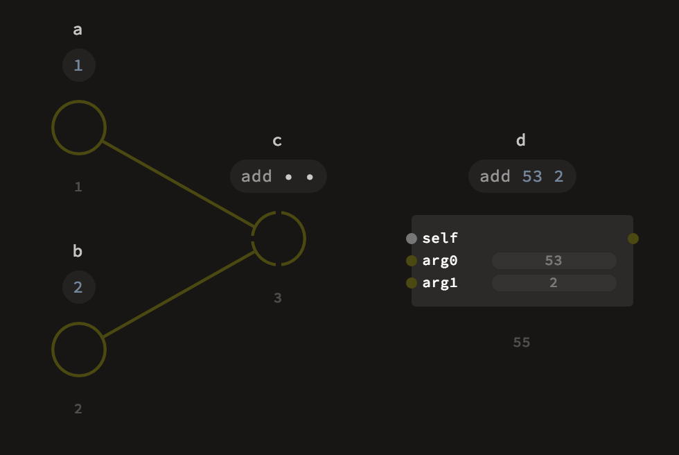
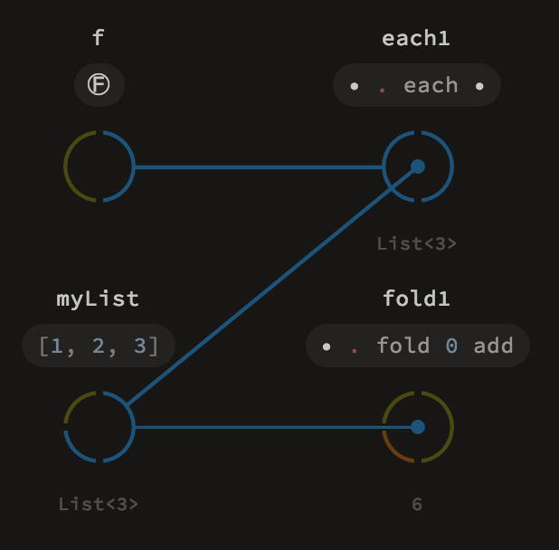

# Functions

Functions are the basic units for reusable logic. A function is a piece of logic that takes any number of arguments, performs some operations and returns a result of these operations. Most nodes you have used so far are actually functions. In this chapter you'll learn how to use functions and how to define them.

## Calling functions

Calling functions in text is accomplished by passing space–separated arguments. In the visual graph it corresponds to setting the values of respective input ports on a node – either by connecting other values to them or setting the values in the expression or by using port controls such as sliders.

```
a = 1
b = 2
c = add a b
d = add 53 2
```


"hello"

## First order functions

Functions in Luna are first order citizens. That means, you can treat them like any other value. You can assign them to variables, pass as arguments to other functions or even store them in other data structures, like lists or maps. Many classes and libraries in Luna define functions or methods which expect other functions as their arguments. Most common examples are `List` methods `each` and `fold`. The former takes a single argument function and calls it on each element of the list, while the latter takes a two-argument function which is used to combine all the elements:
```
f = x: x + 2
myList = [1, 2, 3]
myList.each f        # => [3, 4, 5]
myList.fold 0 add    # => 6
```


## Type of functions

Since functions are ordinary values, they need to have a type (all values in Luna are typed, remember?). The type of function taking an argument `A` and returning a `B` is `A -> B`. It's easy to remember when you think about the arrow as representing a transformation from type `A` to type `B`.

Multi–argument functions are typed using more arrows – for example a function taking a `Real`, an `Int` and returning a `Text` would be typed as `Real -> Int -> Text`. The last part of such an arrow chain is the return value, while all the parts before are consecutive arguments.

## Currying

Luna supports currying. This means, that you may provide fewer arguments than the function expects. This fixes some of the function arguments, allowing to pass the rest later on. This is particularly useful when passing functions as arguments. Using currying, we can rewrite the example from previous section as:
```
myList = [1, 2, 3]
myList.each (+ 2)
```
It is also important to understand how currying works when using nodes. Whenever you don't set a port's value, this argument is automatically curried. This is shown by the changing type of the node's output. Note how the output type changes depending on the number of ports connected, showing the different curried variants of a function:


1. The `add1` node does not set any arguments, thus the output type is `Int -> Int -> Int`,
2. The `add2` node has the second argument connected, so the output type is `Int -> Int`. Note the `_` in it's expression. This underscore introduces explicit currying for this argument – `add _ number1` means "set the second argument and leave the first one unapplied",
3. The `add3` node applies the first argument and leaves the second one. There is no need for the `_` in this case, since the applied argument precedes the unapplied. The type is the same as that of `add2`, since both arguments have the same type.
4. The `add4` node is fully applied, so the return type is just `Int`.

## Lambdas

A lambda is a simple, annonymous function. They are defined with the ``:`` operator. The part before `:` is the lambda argument, while the part after it is the returned value. Thanks to currying it's also possible to define multi-argument lambdas – all you need to do is return another lambda, e.g. `x: y: x + y`.
```
id = x: x
const = x: y: x
myLambda = x: y: z: (x + y) * z
```
Simple lambdas can often be shortened even more by using the `_` idiom, which we have first seen in the section on currying. All occurences of `_` inside a parenthesized expression are replaced with consecutive lambda arguments. This allows to simplify some constructions like this:

```
_.succ              # same as (x: x.succ)
_.toText + _.toText # same as (x: y: x.toText + y.toText)
```

Note that each pair of parentheses creates a new lambda context, so `(_ + 2) + _` is interpreted as `x: (y: y + 2) + x`, not `x: y: (x + 2) + y`.

## Function definitions

Defining toplevel or complex functions is best accomplished with the ``def`` keyword. Any function defined this way on the module toplevel are then visible by any modules importing it (and of course throughout the defining module itself).
To define a function named `foo` in the visual editor just type in `def foo` in the explorer and press <kbd>enter</kbd>. This will create an empty function that you can then enter and complete the logic definition.
The arguments are ports on the left hand side bar, and the returned value is connected to the right hand side.


```
def move shape tx ty:
    translation = translationTrans tx ty
    transformed = shape.transform translation
    transformed
```

There is also a way to create functions out of existing pieces of logic – just select any number of nodes and press <kbd>f</kbd>. The nodes will get folded into a function, with any external input connection becoming an argument, and any external output connection being returned from the function. For example the following graph:

