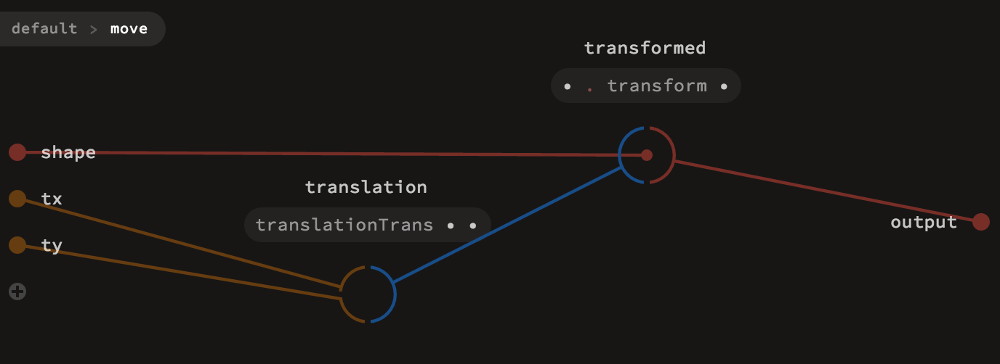

Functions
=========

First order functions
---------------------

Functions in Luna are first order. That means, you can treat them like any other value. You can assign them to variables, pass as function arguments or even store them in other data structures, like lists or maps. Many classes and libraries in Luna define functions or methods which expect other functions as their arguments. Most common examples are List methods `each` and `fold`. The former takes a single argument function and calls it on each element of the list, while the latter takes a two-argument function which is used to combine all the elements:

    f = x: x + 2
    myList = [1, 2, 3]
    myList.each f               # => [3, 4, 5]
    myList.fold 0 (x: y: x + y) # => 6

Currying
--------

All functions are curried. This means, that you may provide less arguments than the function expects. This fixes some of the function arguments, allowing to pass the rest later on. This is particularly useful when passing functions as arguments. Using currying, we can rewrite the example from previous section as:

    myList = [1, 2, 3]
    myList.each (+ 2)
    myList.fold 0 (+)

Lambdas
-------

A lambda is a simple, annonymous function. They are created using the ``:`` operator. The part before `:` is the lambda argument, while the part after is the returned value. Thanks to currying it's also possible to define multi-argument lambdas – all you need to do is return another lambda, e.g. `x: y: x + y`.

    id = x: x
    const = x: y: x
    myLambda = x: y: z: (x + y) * z

Simple lambdas can often be shortened even more by using the `_` idiom. All occurences of `_` inside a parenthesized expression are replaced with consecutive lambda arguments. This allows to simplify some constructions like this:

    _.succ              # same as (x: x.succ)
    _.toText + _.toText # same as (x: y: x.toText + y.toText)

Note that each pair of parentheses creates a new lambda context, so `(_ + 2) + _` is interpreted as `x: (y: y + 2) + x`, not `x: y: (x + 2) + y`.

Function definitions
--------------------

Defining toplevel or complex functions is best accomplished with the ``def`` keyword. The first line defines the function name and its arguments. The last line of a definition is the returned value. In the graphical language, the arguments are ports on the left hand side bar, and the returned value is connected to the right hand side.

    def move shape tx ty:
        translation = translationTrans tx ty
        transformed = shape.transform translation
        transformed

