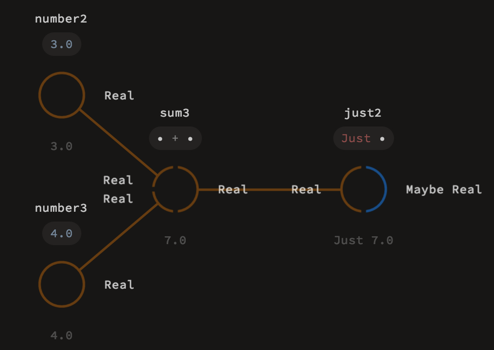
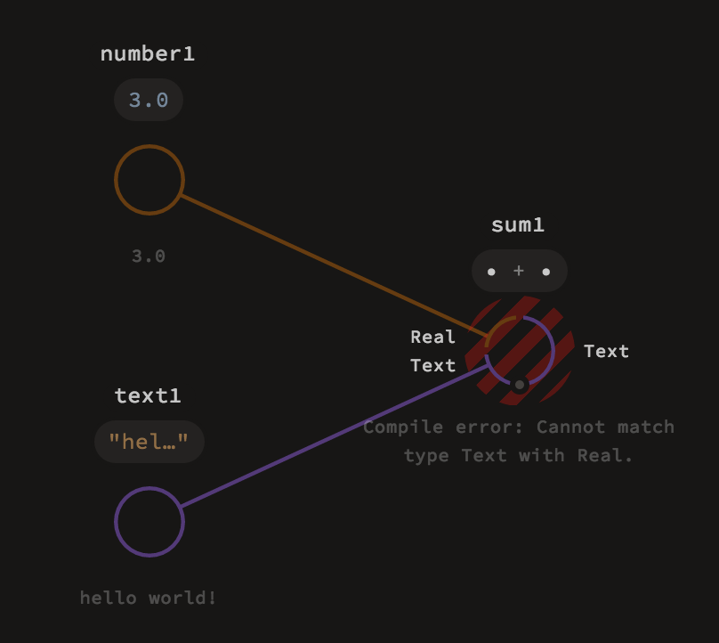

# Types

## What are types and why do they matter?

Luna can process any kind of data. It can compute car's velocity, reply to user's questions via chat-like interface or process all photos from your last trip to San Francisco. Some operations make sense only with very specific kind of data. You can multiply numbers, however it's hard to imagine what would be the result of a cake multiplication. Other operations allow some degree of freedom. Reversing, for example, works with any list with no regard to what its individual elements are. Yet other operations provide more complex constraints. Summing a list will work with any non-empty list containing arithmetic elements only, but we don't really care for the exact structure of these elements. They may be integers, fractions or even matrices, the only requirement is just having an addition operation defined.

-=-=-=-=-=-
In this chapter we introduce the type system, a way Luna handles such constraints. You will learn how types are defined, how to check a type of a given value and what happens when the constraints could not be resolved. The philosophy behind type system is to provide as much safety and useful hints as possible without restricting your expressive powers.

The idea behind a type system **TODO**
The type system in Luna was designed to provide as much safety and useful hints as possible without restricting your expressiveness.

-=-=-=-=-=-

## How do I see types?

The type system in Luna is fundamentally different than any type system used in other statically typed programming languages. It was designed to provide as much safety and useful hints as possible without restricting your expressiveness. You will never need to specify the types manually, the type inferencer computes every type behind the scenes. This computation ensures that any operation can be safely performed, without any contradicting properties arising.

Since the types are usually not expressed in code, we need a way to show them to you. You have probably already noticed that the nodes in our visual editor come in different, seemingly random, colors. Those colors are just one of the ways the visual editor communicates types. Each of the ports on the node is assigned a color corresponding to its type. All the connections are also colored, the colors meaning the type of data "being sent" via this connection.

Colors are a great indication for some values being of different or same types, but it's not enough. Just imagine referring to them like "the text `"hello world!"` has type `magenta`". That's why the colors serve only as visual aids,   but the real types have a text representation. If you hover above a node, the real types are revealed. Each of the node inputs and outputs displays its corresponding type.

In the above image you can see the actual type names and thus understand the behavior of the node:

1. The nodes `number2` and `number3` don't have inputs – they are both constants of type `Real`,
2. The node `sum3` has two `Real` inputs and a `Real` output – it transforms two `Real` numbers into another `Real` number,
3. The node `just2` has a `Real` input and a `Maybe Real` output – it transforms a `Real` number into a `Maybe Real` value.

Oh, and the type of `"hello world!"` is not `magenta`. It's `Text`.

## What happens when I mess up?

Other than providing a better understanding of the program behavior, types have an even more important role to play: they make sure everything will work smoothly and safely. They are crucial in preventing many errors that may accidentally arise during development. So what happens when you make a mistake?

Let's try doing something clearly nonsensical: adding a text and a number. This is how Luna reacts:

Luna's typechecker has found out about our mistake. The `+` function works only with arguments of the same type, so it complained that `Real` and `Text` are not the same and we cannot safely proceed.